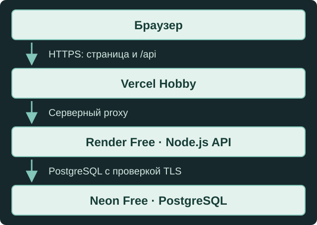

<p align="center">
  
</p>

# Iter — учебный навигатор доступных маршрутов

Iter строит маршрут внутри вымышленного здания с учётом выбранных ограничений и показывает его в 3D, на 2D-схеме и в текстовых шагах. Можно сравнить пути, смоделировать закрытие проходов и отправить учебное сообщение в отдельный журнал препятствий.

**Демонстрация:** [iter-navigator.vercel.app](https://iter-navigator.vercel.app/). **Статус: опубликована; связка Vercel → Render → Neon проверена 9 октября 2026 года.** Это учебный публичный сервис на бесплатном размещении: доступность журнала зависит от пробуждения backend и лимитов платформ.

Проверены health и чтение через `/api` на домене сайта, отправка одной явно вымышленной записи из Chrome, её чтение после перезагрузки страницы и повторный запуск Render. Узкая проверка Neon подтвердила сохранённую запись; повтор исходного `clientRequestId` вернул тот же ID с `replayed: true`, в базе осталась одна запись. Сообщение не изменило маршрут.

В существующем репозитории сохранена история. Генератор создает статические `api/health.mjs` и `api/reports.mjs`, общий серверный `server/vercel-proxy.mjs` и `api/[...path].mjs` для отказа неизвестным API-путям. Это учитывает служебные заголовки и параметры динамических маршрутов Vercel. Приложение, граф и дизайн сохранены.

## Возможности

| Возможность | Поведение, реализованное в коде |
| --- | --- |
| Ограничения маршрута | Минимальная ширина, максимальный уклон, исключение лестниц и требование гладкой поверхности. |
| Неполные данные | По умолчанию неизвестные активные характеристики исключают проход. Посетитель может явно разрешить неопределённые маршруты; известное нарушение ограничения всегда исключает проход. |
| Три представления | 3D-модель Three.js, SVG-схема и текст используют одни и те же упорядоченные ID узлов и рёбер. При сбое WebGL автоматически включается 2D без потери маршрута и настроек. |
| Управление видом | Выбор этажа, поворот, наклон, перемещение и масштаб камеры; показ всего маршрута и фокус на шаге. Камера не меняет требования к маршруту. |
| Сценарии | Перестановка начала и цели, сброс, закрытие проходов и лифтов. Закрытия — локальная симуляция. |
| Отображение | Светлая и тёмная темы, крупный текст, уменьшение движения, адаптивная компоновка. Основные действия доступны через DOM и клавиатуру. |
| Сохранение настроек | Валидный сценарий и предпочтения отображения сохраняются отдельно в `localStorage`; некорректные данные обрабатываются с возвратом к исходным значениям. |
| Журнал препятствий | Чтение страниц и отправка непроверенного текста. Локальный режим использует SQLite; для публичного режима реализован PostgreSQL backend. Сообщения не меняют маршруты. |

Например, путь от входа к кабинету 204 при исходных настройках использует лифт A; его длина в графе — 40 м. При закрытии лифта A путь через лифт B составляет 54 м. У кабинета 205 неизвестны ширина двери и поверхность: строгий режим учитывает эту неопределённость.

Это свойства учебной модели, а не результаты обследования здания.

## Архитектура и стек

- **Интерфейс:** React 19.3.0, TypeScript, Vite 8.3.3; 3D — Three.js 0.186.1, 2D — SVG.
- **Планировщик:** валидация модели и детерминированный поиск кратчайшего пути по отфильтрованному графу в `src/domain`. Расстояния берутся из рёбер графа.
- **Локальный сервис:** Node.js HTTP и встроенный `node:sqlite`, только loopback.
- **Публичный сервис:** Node.js HTTP, `pg` 8.23.1 и PostgreSQL. Запись подтверждается после COMMIT; повтор того же `clientRequestId` и содержимого возвращает сохранённую запись, изменённое содержимое вызывает конфликт.
- **Контракт:** общая валидация DTO, каталог проходов и ошибки в `shared/report-contract.ts`.
- **Проверки полного проекта:** ESLint, TypeScript, Vitest, `node:test` и Playwright. Компилятор — TypeScript 7.0.2 через alias `typescript7`; TypeScript 6.0.3 установлен для совместимости ESLint.

| Путь | Назначение |
| --- | --- |
| `src/data/building.json` | Учебный граф, координаты, расстояния и характеристики проходов. |
| `src/domain/` | Проверка требований, маршрутизация и хранение сценария. |
| `src/components/` | 3D, 2D, настройки отображения и журнал. |
| `src/reports/client.ts` | Запросы к API того же origin, таймауты и проверка ответов. |
| `shared/` | Общий контракт интерфейса и сервиса. |
| `server/` | HTTP, границы запросов и хранилища. |
| `tools/stage-deployment.mjs` | Подготовка очищенного снимка; генерация hosted-конфигурации при передаче двух проверенных origin. |
| `public/brand/` | Существующие SVG-знак, слово Iter и иконки. |

## Требования и установка

Нужны **Node.js 24.19.0 или более поздняя версия ветки 24.x** (`>=24.19.0 <25`) и **pnpm 11.19.0**. Версии прямых зависимостей закреплены; установка использует `pnpm-lock.yaml`.

```sh
pnpm install --frozen-lockfile
pnpm build
```

### Две комплектации репозитория

Публичный GitHub-репозиторий содержит очищенный deployment-снимок, а не полную локальную историю разработки. По проверенному `package.json` в нём доступны только `build`, `start:public` и `test:postgres`. Полный локальный проект дополнительно содержит SQLite-сервис, конфигурацию ESLint и браузерные тесты.

| Команда | Полный локальный проект | Публичный deployment-снимок |
| --- | :---: | :---: |
| `pnpm dev` | Да | — |
| `pnpm preview` | Да | — |
| `pnpm lint` | Да | — |
| `pnpm typecheck` | Да | — |
| `pnpm test` | Да | — |
| `pnpm build` | Да | Да |
| `pnpm test:browser` | Да | — |
| `pnpm start:local` | Да | — |
| `pnpm review:local` | Да | — |
| `pnpm start:public` | Да | Да |
| `pnpm stage:deployment` | Да | — |
| `pnpm test:postgres` | Да | Да |

### Запуск полного локального проекта

Для разработки статического планировщика:

```sh
pnpm dev
```

Адрес: `http://127.0.0.1:5260`. Для просмотра собранной статической версии:

```sh
pnpm build
pnpm preview
```

Адрес: `http://127.0.0.1:4273`. Обычный статический режим не обращается к API журнала.

Для локального планировщика с постоянным SQLite-журналом:

```sh
pnpm build
pnpm start:local
```

Адрес по умолчанию: `http://127.0.0.1:4260`. База — `.local-data/reports.sqlite`; относительный `NAVIGATOR_REPORT_DB` разрешается от корня проекта. `NAVIGATOR_REPORT_PORT` задаёт отдельный порт. Если порт занят существующим preview, используйте другой свободный порт и отдельную базу; сохраняйте работающие журналы.

Локальная обработка записи владельцем файла доступна командой `pnpm review:local <report-uuid> reviewed 1` либо `pnpm review:local <report-uuid> rejected 1`. HTTP-интерфейса модерации нет. Статус «обработано» не означает проверку препятствия или доступности.

### Тестирование полного локального проекта

Следующие команды существуют в локальном `package.json`; в очищенном публичном снимке большинство из них отсутствует:

```sh
pnpm exec playwright install chromium
pnpm lint
pnpm typecheck
pnpm test
pnpm build
pnpm test:browser
```

`pnpm test` запускает Vitest и `node --test server/*.test.ts`. `pnpm test:browser` последовательно запускает три конфигурации Playwright. Браузерные проверки используют порты 4273 и 4261 с отдельными синтетическими SQLite-файлами; эти порты должны быть свободны.

**PostgreSQL-тесты разрушительны для тестовой схемы:** `pnpm test:postgres` использует `NAVIGATOR_PG_TEST_URL`, удаляет схему `iter_journal` через `DROP SCHEMA ... CASCADE` и создаёт синтетические записи. Запускайте их только в отдельной синтетической базе с именем `iter_synthetic_*`. Никогда не направляйте их на рабочую Neon-базу `iter_journal` или базу с нужными данными. Защита по имени базы не заменяет проверку назначения. `NAVIGATOR_PG_TEST_LOCAL=1` предназначен только для изолированного локального тестового PostgreSQL.

Без `NAVIGATOR_PG_TEST_URL` специальный runner завершится ошибкой конфигурации, а реальная PostgreSQL-матрица в общем `pnpm test` будет пропущена. Такой пропуск не подтверждает PostgreSQL или Neon. В продолжении деплоя прошли frozen install и сборка очищенного снимка, линтер и проверка типов полного проекта, 42 frontend- и 45 native-тестов. После исправлений отдельно проверены исходный и сгенерированный прокси. Реальная разрушительная PostgreSQL-матрица в этом запуске пропущена; рабочая Neon-база проверялась только чтением и одной синтетической записью через API. В Chrome проверены desktop/mobile, клавиатурный переход, обе темы, крупный текст, уменьшение движения, закрытия и одинаковые ID маршрута в 3D/2D. Масштаб Chrome 200% и принудительная потеря WebGL в этой сессии не подтверждены.

## Облачная схема

Развёрнутая схема размещения:



Клиент журнала обращается к относительному `/api/reports`; сервис также реализует `/api/health`. Прокси должен быть серверной функцией Vercel с фиксированным адресом Render; его ключ не нужен браузеру. Границы запросов проверяют Host/Origin, прокси-метаданные, тип и размер тела. Прямой публичный вызов Render API не заменяет same-origin интеграцию.

| Переменная | Где используется | Назначение |
| --- | --- | --- |
| `NAVIGATOR_HOSTED_BUILD` | Сборка Vercel | `public-demo` включает маркер публичного журнала в HTML. |
| `NAVIGATOR_PUBLIC_ORIGIN` | Vercel и Render | Точный HTTPS-origin фронтенда без завершающего слеша: `https://iter-navigator.vercel.app`. |
| `NAVIGATOR_PROXY_SECRET` | Только серверы Vercel и Render | Один общий секрет для аутентификации прокси. |
| `DATABASE_URL` | Только Render | Подключение к выделенной Neon-базе; значение — секрет. |
| `NAVIGATOR_DEDICATED_DATABASE` | Render | `iter-public-demo` подтверждает назначение базы. |
| `NODEJS_HELPERS` | Vercel | `0` сохраняет исходный поток запроса для ограниченного чтения тела. |
| `NODE_VERSION` | Render | Версия Node.js, предусмотренная конфигурацией: `24.19.0`. |
| `PORT`, `RENDER_EXTERNAL_URL` | Предоставляет Render | Порт и внешний origin сервиса. |

Публичный backend запускается через `pnpm start:public` (`node server/public-main.ts`) при наличии необходимых серверных переменных. Для Render конфигурация задаёт frozen install и запуск `node server/public-main.ts`; для Vercel генератор задаёт frozen install, `pnpm run build` через закреплённый pnpm 11.19.0 и выходную директорию `dist`.

Backend: `https://iter-public-demo-api.onrender.com`. `GET /healthz` сообщает о готовности процесса. `/api/health` сообщает режим сервиса; ни один из этих ответов отдельно не доказывает успешную запись и последующее чтение в Neon.

По последней ручной настройке пользователя Render использует прямое подключение Neon; текущие значения окружения здесь не проверялись. Совместимость подключения через pooling не подтверждена; автоматически заменять его нельзя. Секреты задаются в серверных настройках хостинга и не публикуются в исходниках, клиентском bundle, `VITE_*`, логах или README.

Подготовка снимка описана в [документации размещения](docs/deployment.md). Генератор требует новую абсолютную директорию вне исходного репозитория и создаёт в ней новую Git-историю. Он не предназначен для перезаписи существующего checkout. Локальные SQLite-базы, приватная история и QA-материалы не входят в публичный снимок.

## Ограничения демонстрации

- Здание, размеры и характеристики вымышлены. Реального обследования нет; расстояния — суммы рёбер учебного графа, а геометрия условна. Приложение не гарантирует доступность или безопасность реального здания.
- Данные неполны. Разрешение неопределённых маршрутов — явный выбор посетителя, а не подтверждение пригодности пути.
- Нет позиционирования, живой информации о лифтах, аккаунтов, вложений или публичной модерации. Все записи журнала остаются непроверенными, включая обработанные; даты отправки не являются датами обследования.
- Используйте в публичном журнале только явно вымышленные примеры без имён, контактов, местоположения и сведений о здоровье. Сообщения доступны другим посетителям.
- Render Free может засыпать, а Neon — приостанавливать вычисления. Пробуждение способно занять около минуты; таймаут клиента — 8 секунд, прокси — 7 секунд. Журнал может быть временно недоступен; планировщик продолжает работать независимо от API.
- При неоднозначном результате отправки форма сохраняет исходный текст и `clientRequestId` в открытой вкладке, не заявляет сохранение и предлагает повтор той же попытки. Перезагрузка или закрытие вкладки теряет черновик; подтверждённые записи хранятся в базе.
- Журнал ограничен 1000 записями, 30 новыми сообщениями в минуту и 500 символами текста; тело запроса — до 4096 байт. Старые записи автоматически не удаляются.
- Поддержка клавиатуры, уменьшения движения и 2D-fallback реализована, но это не сертификат доступности: реальные устройства, экранные дикторы и разные GPU требуют отдельной проверки.
